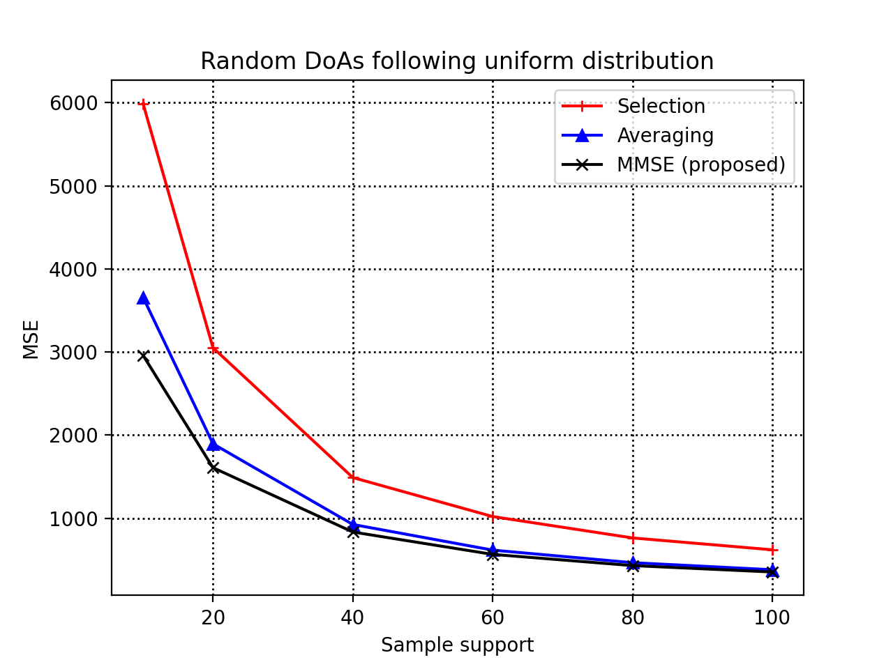
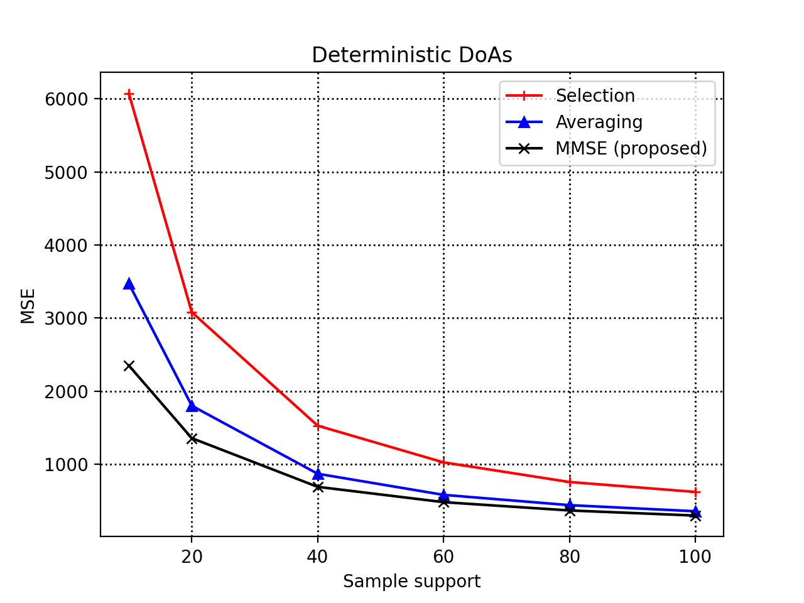

## MMSE-based-autocorrelation-sampling-for-coprime-arrays


In this repo we implement the Minimum-MSE (MMSE) autocorrelation sampling approach for coprime array processing that was derived in [[1]](https://ieeexplore.ieee.org/document/8461676) under an angular distribution assumption. We compare the MMSE sampling approach with the existing selection and averaging sampling approaches with repsect to coarray autocorrelation matrix estimation performance. 

---

IEEE Xplore: https://ieeexplore.ieee.org/document/8461676

---
**Example 1 -- Random DoA sources following uniform distribution**

We start by forming coprime array with coprime integers (M,N).
```python
import numpy as np
import matplotlib.pyplot as plt
from utils import *
from mmse_sampling import *
# channel
carrier_frequency = 1.5 * 10 ** 8
propagation_speed = 3 * 10 ** 8
wavelength = propagation_speed / carrier_frequency
unit_spacing = wavelength / 2
channel = (carrier_frequency, propagation_speed)
# Coprime array with coprimes M, N such that M < N
M = 2
N = 3
p = ca_element_locations(M, N, channel) 
```
Then, we consider source-emitting powers (linear scale) and noise power (also, linear scale).
```python
# source and noise powers
source_powers = np.array([10, 5, 10, 5])
number_of_sources = source_powers.shape[0]
noise_power = 1
```
We form the averaging and selection sampling matrices.
```python
# autocorrelation sampling matrices
Jdict = form_index_sets(M, N , pair_wise_distances(p), channel)
Esel = selection_sampling(Jdict, array_length(M, N), coarray_length(M, N))
Eavg = averaging_sampling(Jdict, array_length(M, N), coarray_length(M, N))
```
Compute matrices required for forming the MMSE sampling matrix
```python
# Matrices required for forming Emmse
int_map = form_integrals_map(M, N, channel)
He = He_matrix(source_powers, noise_power, p, int_map, channel)
P = P_matrix(source_powers, noise_power, p, int_map, channel)
```
Form the smooting matrix.
```python
F = smoothing_matrix(coarray_length(M, N))
```
Sample support axis, number of realizations, and zero-padding.
```python
# Sample support axis and number of realizations
number_of_snapshots_axis = [10, 20, 40, 60, 80, 100]
number_of_realizations = 1500
# Zero - padding
err_sel = np.zeros((len(number_of_snapshots_axis), number_of_realizations))
err_avg = np.zeros((len(number_of_snapshots_axis), number_of_realizations))
err_mmse = np.zeros((len(number_of_snapshots_axis), number_of_realizations))
```
Compute multiple measurents of the squared-error in estimating the true coarray autocorrelation matrix for different DoA sets across realizations.
```python
for j in range(number_of_realizations):
    # DoA sources
    thetas = generate_uniform_doas(number_of_sources)
    # Array response matrix
    S = response_matrix(thetas, p, channel)
    # Nominal Physical autocrrelation matrix
    R = autocorrelation_matrix(S, source_powers, noise_power)
    # Nominal coarray autocorrelation matrix
    Z = spatial_smoothing(F, Esel.T @ R.flatten('F'))
    for i, Q in enumerate(number_of_snapshots_axis):
        Emmse = mmse_sampling(He, P, Esel, Q)
        Y = snapshots(S, source_powers, noise_power, Q)
        Rest = autocorrelation_matrix_est(Y)
        r = Rest.flatten('F')
        Zsel = spatial_smoothing(F, Esel.T @ r)
        Zavg = spatial_smoothing(F, Eavg.T @ r)
        Zmmse = spatial_smoothing(F, Emmse.T @ r)
        err_sel[i , j] = np.linalg.norm(Z - Zsel, 'fro') ** 2
        err_avg[i , j] = np.linalg.norm(Z - Zavg, 'fro') ** 2
        err_mmse[i , j] = np.linalg.norm(Z - Zmmse, 'fro') ** 2
```
Compute the sample-average MSE for each method and plot the results for comparisons.
```python
# Compute the sample-average MSE of each method
err_sel = np.mean(err_sel, axis = 1)
err_avg = np.mean(err_avg, axis = 1)
err_mmse = np.mean(err_mmse, axis = 1)
# Plot and compare MSEs 
plt.figure()
plt.plot(number_of_snapshots_axis, err_sel, '+-r', label = "Selection")
plt.plot(number_of_snapshots_axis, err_avg, '^-b', label = "Averaging")
plt.plot(number_of_snapshots_axis, err_mmse, 'x-k', label = "MMSE (proposed)")
plt.legend()
plt.grid(color='k', linestyle=':', linewidth=1)
plt.ylabel('MSE')
plt.xlabel('Sample support')
plt.title('Random DoAs following uniform distribution')
plt.show()
```

For the configuration above, the sample-average MSEs are shown below: 

 

---
**Example 2 -- Deterministic DoA sources**

Here, we show a similar example. This time, we consider a fixed and deterministic set of DoAs across all realizations of noise.

```python
import numpy as np
import matplotlib.pyplot as plt
from utils import *
from mmse_sampling import *
# channel
carrier_frequency = 1.5 * 10 ** 8
propagation_speed = 3 * 10 ** 8
wavelength = propagation_speed / carrier_frequency
unit_spacing = wavelength / 2
channel = (carrier_frequency, propagation_speed)
# Coprime array with coprimes M, N such that M < N
M = 2
N = 3
p = ca_element_locations(M, N, channel) 
# DoA sources
thetas = np.array([-np.pi / 3, -np.pi / 4, np.pi / 5, 2 * np.pi / 5])
# source and noise powers
source_powers = np.array([10, 5, 10, 5])
noise_power = 1
# Array response matrix
S = response_matrix(thetas, p, channel)
# Nominal Physical autocrrelation matrix
R = autocorrelation_matrix(S, source_powers, noise_power)
# autocorrelation sampling matrices
Jdict = form_index_sets(M, N , pair_wise_distances(p), channel)
Esel = selection_sampling(Jdict, array_length(M, N), coarray_length(M, N))
Eavg = averaging_sampling(Jdict, array_length(M, N), coarray_length(M, N))
int_map = form_integrals_map(M, N, channel)
He = He_matrix(source_powers, noise_power, p, int_map, channel)
P = P_matrix(source_powers, noise_power, p, int_map, channel)
# Nominal coarray autocorrelation matrix
F = smoothing_matrix(coarray_length(M, N))
Z = spatial_smoothing(F, Esel.T @ R.flatten('F'))
# Sample support axis and number of realizations
number_of_snapshots_axis = [10, 20, 40, 60, 80, 100]
number_of_realizations = 1500
# Zero - padding
err_sel = np.zeros((len(number_of_snapshots_axis), number_of_realizations))
err_avg = np.zeros((len(number_of_snapshots_axis), number_of_realizations))
err_mmse = np.zeros((len(number_of_snapshots_axis), number_of_realizations))
for i, Q in enumerate(number_of_snapshots_axis):
    Emmse = mmse_sampling(He, P, Esel, Q)
    for j in range(number_of_realizations): 
        Y = snapshots(S, source_powers, noise_power, Q)
        Rest = autocorrelation_matrix_est(Y)
        r = Rest.flatten('F')
        Zsel = spatial_smoothing(F, Esel.T @ r)
        Zavg = spatial_smoothing(F, Eavg.T @ r)
        Zmmse = spatial_smoothing(F, Emmse.T @ r)
        err_sel[i , j] = np.linalg.norm(Z - Zsel, 'fro') ** 2
        err_avg[i , j] = np.linalg.norm(Z - Zavg, 'fro') ** 2
        err_mmse[i , j] = np.linalg.norm(Z - Zmmse, 'fro') ** 2
# Compute the sample-average MSE of each method
err_sel = np.mean(err_sel, axis = 1)
err_avg = np.mean(err_avg, axis = 1)
err_mmse = np.mean(err_mmse, axis = 1)
# Plot and compare MSEs 
plt.figure()
plt.plot(number_of_snapshots_axis, err_sel, '+-r', label = "Selection")
plt.plot(number_of_snapshots_axis, err_avg, '^-b', label = "Averaging")
plt.plot(number_of_snapshots_axis, err_mmse, 'x-k', label = "MMSE (proposed)")
plt.legend()
plt.grid(color='k', linestyle=':', linewidth=1)
plt.ylabel('MSE')
plt.xlabel('Sample support')
plt.title('Deterministic DoAs')
plt.show()
```
Sample results are shown below: 

 

---
**Questions/issues**
Inquiries regarding the scripts provided below are cordially welcome. In case you spot a bug, please let me know. 

---
**Citing**

If you use our algorithms, please cite [[1]](https://ieeexplore.ieee.org/document/8461676).

```bibtex
@INPROCEEDINGS{8461676,
  author={D. G. {Chachlakis} and P. P. {Markopoulos} and F. {Ahmad}},
  booktitle={2018 IEEE International Conference on Acoustics, Speech and Signal Processing (ICASSP)}, 
  title={Mmse-Based Autocorrelation Sampling for Comprime Arrays}, 
  year={2018},
  volume={},
  number={},
  pages={3474-3478},
  doi={10.1109/ICASSP.2018.8461676}}
```
[[1]](https://ieeexplore.ieee.org/document/8461676) D. G. Chachlakis, P. P. Markopoulos and F. Ahmad, "Mmse-Based Autocorrelation Sampling for Comprime Arrays," 2018 IEEE International Conference on Acoustics, Speech and Signal Processing (ICASSP), Calgary, AB, 2018, pp. 3474-3478, doi: 10.1109/ICASSP.2018.8461676.

---

**Related works**

The following works might be of interest:

* [[2]](https://ieeexplore.ieee.org/document/8313121) D. G. Chachlakis, P. P. Markopoulos and F. Ahmad, "The Mean-Squared-Error of autocorrelation sampling in coprime arrays," 2017 IEEE 7th International Workshop on Computational Advances in Multi-Sensor Adaptive Processing (CAMSAP), Curacao, 2017, pp. 1-5, doi: 10.1109/CAMSAP.2017.8313121.